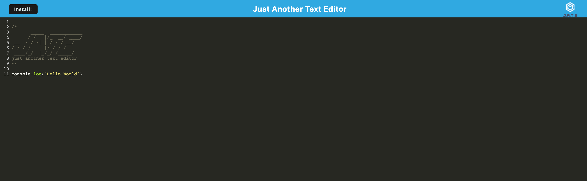

# Text-Editor 

  ## Description

  
   I wanted to be able to better understand PWA's and how they are built and how webpack can be used to create a PWA and keep information and application persistent even without any connection. PWA can operate offline making that useful for certain application and solving that problem if your application is a vital part of a process and having it go down due to network issues can cause a lot of frustration. Using a PWA is a great option for applications that need to run always and may at times not have network to run off of.

  ## Table of Contents
  
  - [Installation](#installation)
  - [Usage](#usage)
  - [Credits](#credits)
  - [License](#license)
  - [Features](#features)
  - [Tests](#tests)
  - [Questions](questions)

  
  ## Installation
  

  1) Clone repo into local repository. 2) cd into where repo is located and use  "npm i" in command line to install all packages. 3) then "npm run start:dev" to run server and client server at the same time.
  

  ## Usage
  

  1) Open up the application and in the provided space you are able to write in text editor. 2) if you click away from the main editor you should be able to keep the information persistent as it is cached in the database. 3) go offline and data should still remain persistent and application will still function.

  

  Visit deployed site below!

  [Deployed site]()

  ## Credits
  

  David Rios
  

 ## License

  License is MIT License

    
    

  ## Features

  
  JavaScript, npm, node.js, html, css, express.js, webpack, babel

  ## Tests

    N/A
    

    
    
  

  ## Questions

  GitHub: [David Elijah Rios](https://github.com/David Elijah Rios)

  Please Feel free to contact me at david.riostech@outlook.com if you have any questions.
